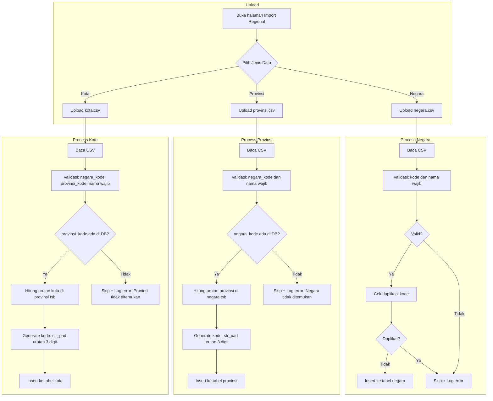

# Rencana Implementasi Import CSV Data Regional

## 📋 Ringkasan

Membuat fitur import CSV untuk data regional (negara, provinsi, kota) dengan:
- File terpisah untuk setiap jenis data
- Template CSV yang bisa diunduh
- Auto-generate kode untuk provinsi dan kota
- **Format tanggal: dd/mm/yyyy**
- **Digabung dengan `pengurus_import.php`** (tab terpisah)

---

## 🗃️ Struktur Database

### Tabel `negara`
| Kolom | Tipe | Required | Keterangan |
|-------|------|----------|------------|
| kode | varchar(10) | ✅ Ya | Manual, 2 karakter (contoh: ID, MY) |
| nama | varchar(100) | ✅ Ya | Nama negara |
| sk_kepengurus | varchar(50) | ❌ Tidak | Nomor SK |
| periode_mulai | date | ❌ Tidak | Tanggal mulai periode |
| periode_akhir | date | ❌ Tidak | Tanggal akhir periode |
| alamat_sekretariat | text | ❌ Tidak | Alamat sekretariat |

### Tabel `provinsi`
| Kolom | Tipe | Required | Keterangan |
|-------|------|----------|------------|
| negara_kode | varchar(10) | ✅ Ya | Kode negara induk (foreign key) |
| kode | varchar(20) | ⚙️ Auto | Dibuat otomatis: 001, 002, 003... |
| nama | varchar(100) | ✅ Ya | Nama provinsi |
| sk_kepengurus | varchar(50) | ❌ Tidak | Nomor SK |
| periode_mulai | date | ❌ Tidak | Tanggal mulai periode |
| periode_akhir | date | ❌ Tidak | Tanggal akhir periode |
| alamat_sekretariat | text | ❌ Tidak | Alamat sekretariat |

### Tabel `kota`
| Kolom | Tipe | Required | Keterangan |
|-------|------|----------|------------|
| negara_kode | varchar(10) | ✅ Ya | Kode negara induk |
| provinsi_kode | varchar(20) | ✅ Ya | Kode provinsi induk (foreign key) |
| kode | varchar(20) | ⚙️ Auto | Dibuat otomatis: 001, 002, 003... |
| nama | varchar(100) | ✅ Ya | Nama kota/kabupaten |
| sk_kepengurus | varchar(50) | ❌ Tidak | Nomor SK |
| periode_mulai | date | ❌ Tidak | Tanggal mulai periode |
| periode_akhir | date | ❌ Tidak | Tanggal akhir periode |
| alamat_sekretariat | text | ❌ Tidak | Alamat sekretariat |

---

## 📄 Format Template CSV

### 1. Template `negara.csv`
```csv
kode,nama,sk_kepengurus,periode_mulai,periode_akhir,alamat_sekretariat
ID,Indonesia,SK/001/2024,01/01/2024,31/12/2027,"Jl. Contoh No. 123, Jakarta"
MY,Malaysia,SK/002/2024,01/01/2024,31/12/2027,"Jl. Contoh No. 456, Kuala Lumpur"
SG,Singapura,,,,
```

**Format tanggal: dd/mm/yyyy**

**Kolom Required:**
- `kode` - 2 karakter (wajib diisi manual)
- `nama` - Nama negara

### 2. Template `provinsi.csv`
```csv
negara_kode,nama,sk_kepengurus,periode_mulai,periode_akhir,alamat_sekretariat
ID,Jawa Timur,SK/JTM/001/2024,01/01/2024,31/12/2027,"Jl. Contoh No. 1, Surabaya"
ID,Jawa Barat,SK/JBR/001/2024,01/01/2024,31/12/2027,"Jl. Contoh No. 2, Bandung"
ID,DKI Jakarta,,,,
MY,Selangor,,,,
```

**Format tanggal: dd/mm/yyyy**

**Kolom Required:**
- `negara_kode` - Kode negara (harus sudah ada di tabel negara)
- `nama` - Nama provinsi

**Auto-generate:**
- `kode` - Akan dibuat otomatis: 001, 002, 003... per negara

### 3. Template `kota.csv`
```csv
negara_kode,provinsi_kode,nama,sk_kepengurus,periode_mulai,periode_akhir,alamat_sekretariat
ID,001,Surabaya,SK/SBY/001/2024,01/01/2024,31/12/2027,"Jl. Contoh No. 1, Surabaya"
ID,001,Malang,,,,
ID,001,Gresik,,,,
ID,002,Bandung,,,,
```

**Format tanggal: dd/mm/yyyy**

**Kolom Required:**
- `negara_kode` - Kode negara (harus sudah ada)
- `provinsi_kode` - Kode provinsi (harus sudah ada di tabel provinsi)
- `nama` - Nama kota/kabupaten

**Auto-generate:**
- `kode` - Akan dibuat otomatis: 001, 002, 003... per provinsi

---

## 🔄 Alur Import



---

## 📁 File yang Akan Dibuat/Dimodifikasi

### 1. `pages/admin/pengurus_import.php` (MODIFIKASI)
Halaman import yang sudah ada akan ditambahkan:
- Tab untuk setiap jenis data (Pengurus, Negara, Provinsi, Kota)
- Tombol download template CSV untuk masing-masing jenis
- Form upload CSV untuk masing-masing jenis
- Log hasil import

### 2. `templates/csv/negara_template.csv` (BARU)
Template CSV untuk data negara

### 3. `templates/csv/provinsi_template.csv` (BARU)
Template CSV untuk data provinsi

### 4. `templates/csv/kota_template.csv` (BARU)
Template CSV untuk data kota

---

## ⚙️ Implementasi Auto-Generate Kode

### Provinsi
```php
function generateProvinsiCode($conn, $negara_id) {
    // Hitung jumlah provinsi yang sudah ada di negara tersebut
    $result = $conn->query("SELECT COUNT(*) as cnt FROM provinsi WHERE negara_id = $negara_id");
    $count = $result->fetch_assoc()['cnt'];
    
    // Kode baru = jumlah + 1, dengan padding 3 digit
    $urutan = $count + 1;
    return str_pad($urutan, 3, '0', STR_PAD_LEFT); // 001, 002, 003...
}
```

### Kota
```php
function generateKotaCode($conn, $provinsi_id) {
    // Hitung jumlah kota yang sudah ada di provinsi tersebut
    $result = $conn->query("SELECT COUNT(*) as cnt FROM kota WHERE provinsi_id = $provinsi_id");
    $count = $result->fetch_assoc()['cnt'];
    
    // Kode baru = jumlah + 1, dengan padding 3 digit
    $urutan = $count + 1;
    return str_pad($urutan, 3, '0', STR_PAD_LEFT); // 001, 002, 003...
}
```

---

## ✅ Checklist Implementasi

- [ ] Buat folder `templates/csv/` jika belum ada
- [ ] Buat template CSV untuk negara
- [ ] Buat template CSV untuk provinsi
- [ ] Buat template CSV untuk kota
- [ ] Modifikasi `pengurus_import.php` - tambahkan tab untuk Negara, Provinsi, Kota
- [ ] Implementasi upload dan parsing CSV untuk negara
- [ ] Implementasi upload dan parsing CSV untuk provinsi dengan auto-generate kode
- [ ] Implementasi upload dan parsing CSV untuk kota dengan auto-generate kode
- [ ] Implementasi validasi data
- [ ] Implementasi log hasil import
- [ ] Implementasi download template

---

## 🔗 Relasi dengan Fitur Lain

Fitur ini terkait dengan:
- **Settings** - Halaman settings sudah menampilkan tabel negara, provinsi, kota
- **No Anggota** - Format no_anggota menggunakan kode negara, provinsi, kota
- **Ranting** - Ranting terhubung dengan kota
